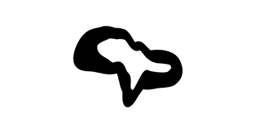

<a name="readme-top"></a>

<!-- PROJECT SHIELDS -->
<!--
*** I'm using markdown "reference style" links for readability.
*** Reference links are enclosed in brackets [ ] instead of parentheses ( ).
*** See the bottom of this document for the declaration of the reference variables
*** for contributors-url, forks-url, etc. This is an optional, concise syntax you may use.
*** https://www.markdownguide.org/basic-syntax/#reference-style-links
-->

[![Contributors][contributors-shield]][contributors-url]
[![Forks][forks-shield]][forks-url]
[![Stargazers][stars-shield]][stars-url]
[![Issues][issues-shield]][issues-url]
[![MIT License][license-shield]][license-url]

<!-- PROJECT LOGO -->
<br />
<div align="center">
  <a href="https://github.com/ntentart/ntent-archive">
    
  </a>

<h3 align="center">Archive by ntent.art</h3>

  <p align="center">
    Archive by ntent.art assists in archiving multimedia content + NFT metadata. 
    Includes support for html-based projects. Easily uploaded to IPFS via 
    NFT.STORAGE for decentralized storage.
    <br />
    <a href="https://github.com/ntentart/ntent-archive/blob/master/examples.js"><strong>Explore the examples »</strong></a>
    <br />
    <br />
    <a href="https://github.com/ntentart/ntent-archive/issues">Report Bug</a>
    ·
    <a href="https://github.com/ntentart/ntent-archive/issues">Request Feature</a>
  </p>
</div>

<!-- TABLE OF CONTENTS -->
<details>
  <summary>Table of Contents</summary>
  <ol>
    <li>
      <a href="#about-the-project">About The Project</a>
      <ul>
        <li><a href="#built-with">Built With</a></li>
      </ul>
    </li>
    <li>
      <a href="#getting-started">Getting Started</a>
      <ul>
        <li><a href="#prerequisites">Prerequisites</a></li>
        <li><a href="#installation">Installation</a></li>
      </ul>
    </li>
    <li><a href="#usage">Usage</a></li>
    <li><a href="#roadmap">Roadmap</a></li>
    <li><a href="#contributing">Contributing</a></li>
    <li><a href="#license">License</a></li>
    <li><a href="#contact">Contact</a></li>
    <li><a href="#acknowledgments">Acknowledgments</a></li>
  </ol>
</details>

<!-- ABOUT THE PROJECT -->

## About The Project

[![Product Name Screen Shot][product-screenshot]](https://ntent.art)

<p align="right">(<a href="#readme-top">back to top</a>)</p>

## Built With

<div>
    <a href="https://ntent.art">
        
    </a>
</div>
<div>
    <a href="https://nft.storage">
        
    </a>
</div>
<div>
    <a href="https://ipfs.io">
        
    </a>
</div>

<p align="right">(<a href="#readme-top">back to top</a>)</p>


<!-- GETTING STARTED -->

## Getting Started

Most methods take the following 4 parameters:

1. Metadata
    a. If using an 'NFT' method, requires compliant ERC-721 NFT Metadata, example below. https://github.com/ethereum/EIPs/blob/master/EIPS/eip-721.md
    b. else only 'name', and 'description' are required, but you can include any describing metadata.

2. Content Options object, you need to use the appropriate format, more info / examples below.

3. Tags used to find this content later, ie search, etc.

4. Optionally, include your creator id if you've been given one.


**1. Compliant NFT Metadata Example JSON**

```js
 {
     "platform": "ntent.art",
     "name": "Moment After",
     "series": "1",
     "description": "Moment After by ntent.art is a 1 of 1 piece of digital art at the intersection of multimedia, performance, and abstract generative art.  Moment After combines the human side of interaction and technology with the ephemeral nature of performance + the permanence of the blockchain.  Moment After brings attention to the moment after the climax in any interaction.  Do you feel good, or do you feel off?  Feel into the moment after. Please allow 10-15 minutes for loading to complete.",
     "external_url": "https://app.ntent.art/n/project/8",
     "artist": "ntent.art",
     "collection_name": "ntent.art",
     "traits": [{
         "trait_type": "Project",
         "value": "1 of 1's"
     }],
     "attributes": [{
         "trait_type": "Project",
         "value": "1 of 1's"
     }],
     "features": ["Project : 1 of 1's"],
     "website": "https://app.ntent.art",
     "tokenID": "1",
     "license": "MIT",
     "projectId": "1",
     "image": "https://hosted.ntent.art/images/ma.jpeg",
     "full_screen_url": "https://hosted.ntent.art/projects/moment-after/index.html",
     "animation_url": "https://hosted.ntent.art/projects/moment-after/index.html",
     "interactive_nft": {
         "code_uri": "https://hosted.ntent.art/projects/moment-after/index.html"
     }
 }

```

**2. Content Options Properties**
_Use the following formats, and see below for examples._

```js
var contentOptions = {
    image: {
        buffer: buffer,
        filename: filename,
    },
    gif: {
        buffer: buffer,
        filename: filename,
    },
    video: {
        buffer: buffer,
        filename: filename,
    },
    other: {
        buffer: buffer,
        filename: filename,
    },
    //'files' objects for html and collection must be an array of buffers
    //populate 'rootFolder' with root project folder if applicable
    html: {
        files: files,
        rootFolder: rootFolder,
    },

    collection: {
        files: files,
        rootFolder: rootFolder,
    },
}

```

**Content Options Notes**


    Single File
    If archiving a single file, and the file is not an image, gif, or video, use the other property and format.

    Collection of Files
    It is recommended to upload one file at a time, for archiving purposes, which gives each its own metadata, but if more appropriate, you can upload a collection and provide a single metadata file for the whole collection.

    If uploading multiple files with a single metadata file, use the collection property and format.

    Html Projects
    If uploading an html project, use the html property and format.

    NFT Assets
    For 'NFT' methods, the image property and format is required, and will be used as a preview image if other files are included.

### Installation

Option 1 : Install npm package in your project

1. Get a free API Key at [https://nft.storage](https://nft.storage)
2. Install into your project with npm
    ```sh
     npm install ntent-archive
    ```
3. Add the require like this:
    ```js
    var NtentArchive = require('ntent-archive')
    ```
4. Pass in your API Key to the NtentArchive constructor in your code.
    ```js
    var nArchive = new NtentArchive(nftStorageApiKey)
    ```
5. See <a href="#usage">Usage</a> below and examples.js for examples/usage details.

<br>

Option 2 : Clone the repo and play with the examples

1. Get a free API Key at [https://nft.storage](https://nft.storage)
2. Clone the repo
    ```sh
    git clone https://github.com/ntentart/ntent-archive.git
    ```
3. From the project root, install NPM packages
    ```sh
    npm install
    ```
4. Enter your API in `examples.js`
    ```js
    const nftStorageApiKey = 'API_KEY_HERE'
    ```
5. Now you can run the examples, feel free to try them all!
    ```sh
     node examples.js
    ```

<p align="right">(<a href="#readme-top">back to top</a>)</p>

<!-- USAGE EXAMPLES -->

## Usage

    Example 1 : NFT with Html Based Content (maybe a generative art project)

```js
//define whatever NFT meta is relevant to you!
//make sure to include minimum ERC-721 standard properties
var testMetadata = {
    name: 'NFT Upload Test',
    description: 'This describes the NFT in great detail.',
    artist: 'jiwa',
    collection_name: 'Digital Dust Bowl; the Collapse of the Entire Internet',
}

//include preview image for this html page
var nftImage = await fs.readFileSync('./assets/example.png')

//define project folder
var nftGenArtProjectFolder = './html-site-example'

//get all directory contents
//should be an array of objects with this format:
//{
// path: `${dirName}/${item.name}`,
// buffer: fs.readFileSync(`${dirName}/${item.name}`),
// filename: item.name
//}
var nftGenArtProject = await getDirectoryContents(nftGenArtProjectFolder, [])

//initialize ntent archive, passing in nft.storage API Key
//optionally include preferred gateway
var nArchive = new NtentArchive(nftStorageApiKey, preferredIpfsGatewayBaseUrl)

//trims each string, converts to lower case, and removes duplicates
var tags = ['art', 'generative art', 'generative', 'jiwa', 'ntent']

// include our relevant content options for this upload
var contentOptions = {
    image: {
        buffer: nftImage,
        filename: 'image.png',
    },
    html: {
        files: nftGenArtProject,
        rootFolder: nftGenArtProjectFolder,
    },
}

//and let it fly
var result = await nArchive.archiveToken(
    testMetadata,
    contentOptions,
    tags,
    '123'
)

//success! do what you want with the results
if (result) console.log(JSON.stringify(result))
else console.log('Archive failed! Check the logs.')
```

    Example 2 : NFT with Video Content

```js
//define whatever NFT meta is relevant to you!
//make sure to include minimum ERC-721 standard properties
var testMetadata = {
    name: 'NFT Upload Test',
    description: 'This describes the NFT in great detail.',
    artist: 'jiwa',
    collection_name: 'Digital Dust Bowl; the Collapse of the Entire Internet',
}

//get file buffers of relevant files
var nftImage = await fs.readFileSync('./assets/example.png')
var nftVideo = await fs.readFileSync('./assets/example-vid.mp4')

//initialize ntent archive, passing in nft.storage API Key
//optionally include preferred gateway
var nArchive = new NtentArchive(nftStorageApiKey, preferredIpfsGatewayBaseUrl)

//ntent archive will trim each string,
//convert to lower case, and remove duplicates.
var tags = ['art', 'generative art', 'generative', 'jiwa', 'ntent']

// include our relevant content options for this upload
var contentOptions = {
    image: {
        buffer: nftImage,
        filename: 'image.png',
    },
    video: {
        buffer: nftVideo,
        filename: 'video.mp4',
    },
}

//and let it fly
var result = await nArchive.archiveToken(
    testMetadata,
    contentOptions,
    tags,
    '123'
)

//success! do what you want with the results
if (result) console.log(JSON.stringify(result))
else console.log('Archive failed! Check the logs.')
```

More examples in <a href="https://github.com/ntentart/ntent-archive/blob/master/examples.js">examples.js</a>

**Result Example**

```js
{
   "name":"NFT Upload Test",
   "description":"This describes the NFT in great detail.",
   "artist":"jiwa",
   "collection_name":"Digital Dust Bowl; the Collapse of the Entire Internet",
   "creatorId":"123",
   "archivalTags":[
      "art",
      "generative art",
      "generative",
      "jiwa",
      "ntent",
      "video",
      "video/mp4",
      "video.mp4"
   ],
   "created":1671394067306,
   "createdFriendly":"21:07:47 GMT+0100 (Central European Standard Time)",
   "interactive_nft":{
      "code_uri":"ipfs://bafybeidjyubn4ycd3s6w5eefec6y6rlsr6vj4v6uvqz75zgajjncd2cbzu/video.mp4"
   },
   "image":"ipfs://bafybeihjqqfjuucgui6n5kl2qviofwe3z3dt3nnnt275pkfqutddwjt3ra/image.png",
   "full_screen_url":"ipfs://bafybeidjyubn4ycd3s6w5eefec6y6rlsr6vj4v6uvqz75zgajjncd2cbzu/video.mp4",
   "animation_url":"ipfs://bafybeidjyubn4ycd3s6w5eefec6y6rlsr6vj4v6uvqz75zgajjncd2cbzu/video.mp4",
   "ipfsCid":"bafyreifpz67hrkydnmpimgii6rqcqvciqoi2xsmxow4fnhoz527nvk2n4e",
   "gatewayUrl":"https://bafyreifpz67hrkydnmpimgii6rqcqvciqoi2xsmxow4fnhoz527nvk2n4e.ipfs.nftstorage.link/metadata.json"
}
```

<p align="right">(<a href="#readme-top">back to top</a>)</p>

<!-- ROADMAP -->

## Roadmap

See the [open issues](https://github.com/ntentart/ntent-archive/issues) for a full list of proposed features (and known issues).

<p align="right">(<a href="#readme-top">back to top</a>)</p>

<!-- CONTRIBUTING -->

## Contributing

Contributions are what make the open source community such an amazing place to learn, inspire, and create. Any contributions you make are **greatly appreciated**.

If you have a suggestion that would make this better, please fork the repo and create a pull request. You can also simply open an issue with the tag "enhancement".
Don't forget to give the project a star! Thanks again!

1. Fork the Project
2. Create your Feature Branch (`git checkout -b feature/AmazingFeature`)
3. Commit your Changes (`git commit -m 'Add some AmazingFeature'`)
4. Push to the Branch (`git push origin feature/AmazingFeature`)
5. Open a Pull Request

<p align="right">(<a href="#readme-top">back to top</a>)</p>

<!-- LICENSE -->

## License

Distributed under the MIT License. See `LICENSE.txt` for more information.

<p align="right">(<a href="#readme-top">back to top</a>)</p>

<!-- CONTACT -->

## Contact

jiwa - [@ntentart](https://twitter.com/ntentart) - iam@ntent.art

[ntent.art](ntent.art) empowers artists and institutions with fine art technologies for Web3. Our tools and applications offer Web3 integration with the ability to produce generative and dynamic art experiences on the blockchain.

<p align="right">(<a href="#readme-top">back to top</a>)</p>

<!-- ACKNOWLEDGMENTS -->

## Acknowledgments

Thanks to goes to the universe.

<p align="right">(<a href="#readme-top">back to top</a>)</p>

<!-- MARKDOWN LINKS & IMAGES -->
<!-- https://www.markdownguide.org/basic-syntax/#reference-style-links -->

[contributors-shield]: https://img.shields.io/github/contributors/ntentart/ntent-archive.svg?style=for-the-badge
[contributors-url]: https://github.com/ntentart/ntent-archive/graphs/contributors
[forks-shield]: https://img.shields.io/github/forks/ntentart/ntent-archive.svg?style=for-the-badge
[forks-url]: https://github.com/ntentart/ntent-archive/network/members
[stars-shield]: https://img.shields.io/github/stars/ntentart/ntent-archive.svg?style=for-the-badge
[stars-url]: https://github.com/ntentart/ntent-archive/stargazers
[issues-shield]: https://img.shields.io/github/issues/ntentart/ntent-archive.svg?style=for-the-badge
[issues-url]: https://github.com/ntentart/ntent-archive/issues
[license-shield]: https://img.shields.io/github/license/ntentart/ntent-archive.svg?style=for-the-badge
[license-url]: https://github.com/ntentart/ntent-archive/blob/master/LICENSE.txt
[product-screenshot]: assets/banner.png
[ntent.art]: assets/logo.png
[ntent-url]: https://ntent.art/
[nft.storage]: assets/nftstorage.png
[nftstorage-url]: https://nft.storage/
[ipfs.io]: assets/ipfs.png
[ipfs-url]: https://ipfs.io/
